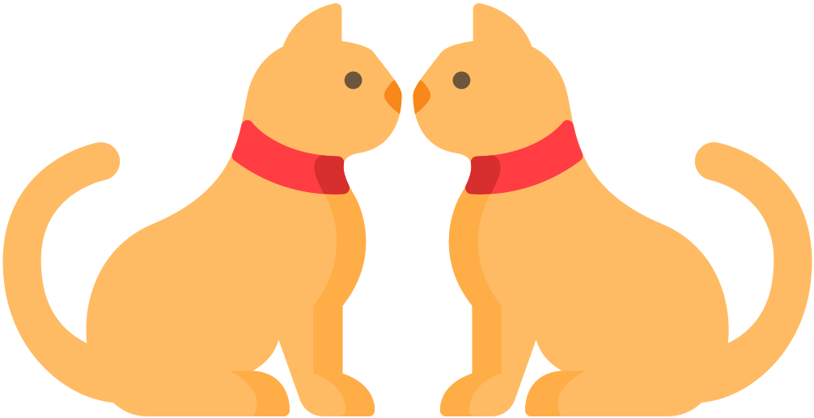
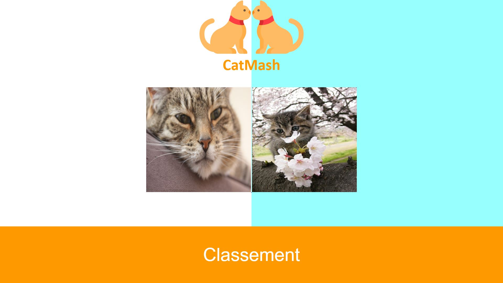
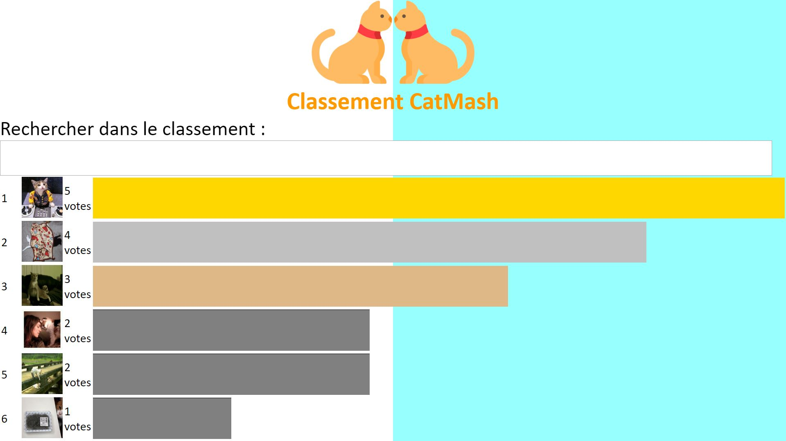

# CatMash

Cette application web permet de connaître quel chat est le plus mignon.

Elle est disponible à l'adresse : https://catmash-paris.herokuapp.com/

## But de l'application

Les utilisateurs doivent cliquer sur une image pour choisir le chat le plus mignon à leurs goûts.

Une page de classement permettra de voir tous les chats les plus mignons.

Une API est disponible pour exploiter son fonctionnement.

Une Progressive Web App est aussi disponible sur Google Chrome.

## Interface Web

### Page de vote

### Page de classement

## API

Son adresse est https://catmash-paris.herokuapp.com/api/

### GET /cats
	Obtenir la liste des chats

### GET /cats/vote/:catId
	Voter pour un chat avec son id donné en paramètre dans l'URL

### GET /cats/randoms
	Obtenir 2 chats au hazard
